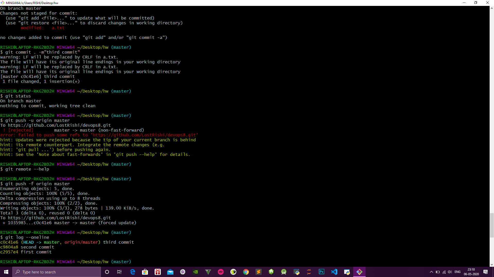
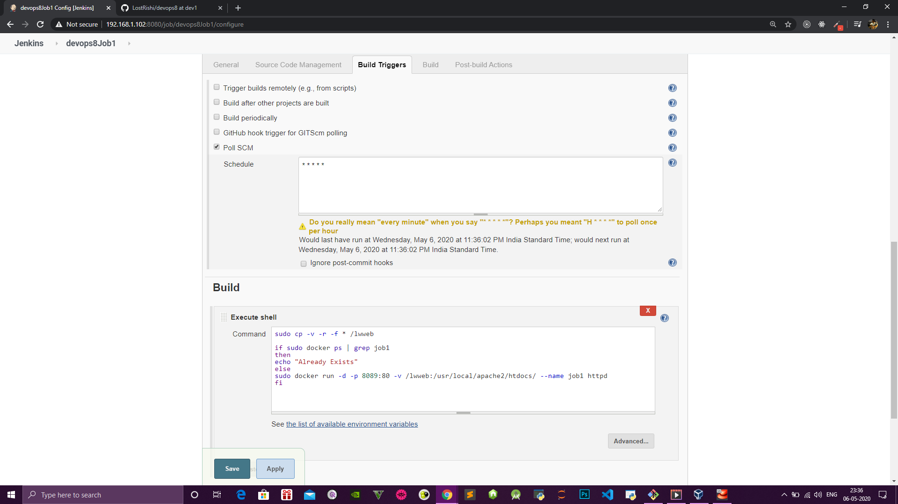
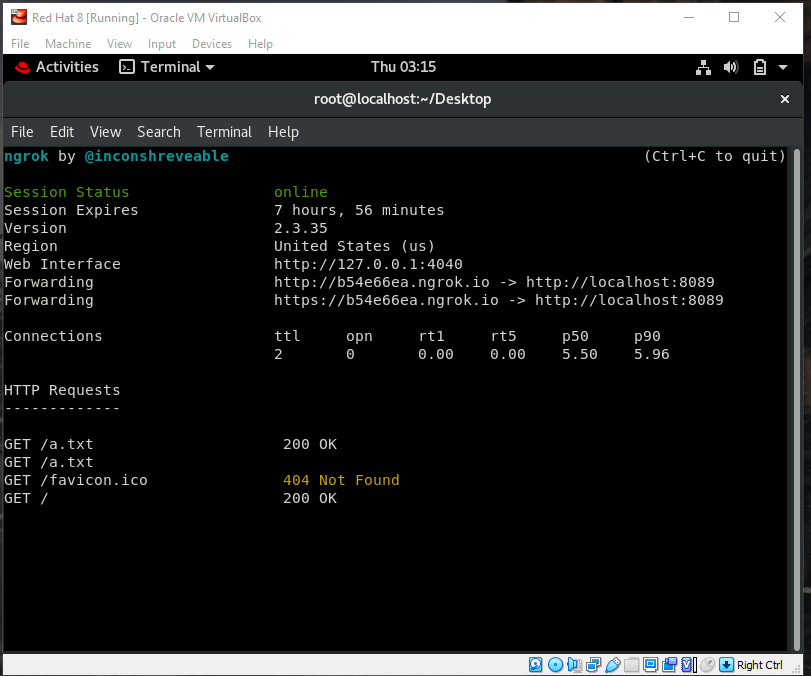

# PROJECT - INTEGRATING GIT WITH JENKINS


### You should have **Git** , **Docker**, **Jenkins** pre-installed.
### **GitHub** plugin should also be installed in Jenkins
--- 

1. **Create a local repo and also create one more branch apart from master (dev1) branch.** Create a txt file and some code both in master and dev1 branch and push them to remote repository.




---
### 2. **In Jenkins we have to do three jobs** :

* 1st Job
    * This job will go to github ,download the code from dev1 branch and deploy it to the *testing server*.
    * Configure this job to first go to github and if any changes has been made in dev1 branch then download that code and copy that code to a folder *lwweb* in virtual machine(here *RHEL8*). Use *PollSCM* to track the changes in the code in dev1 branch.

    

    


* 2nd Job
    * This job will go to github ,download the code from master branch and deploy it to the *production server*.
    * Configure this job to first go to github and if any changes has been made in master branch then download that code and copy that code to a folder *lwweb* in virtual machine(here *RHEL8*). Again Use *PollSCM* to track the changes in the code in master branch.

    

    

* 3rd Job
    * This job will go to github ,*merge the dev1 branch to master* branch only if job1 is success(upstream-job1) and if its running successfully then git merge will automatically trigger. The master code will be changed .This changed code will lead in triggering of job2 and deployment of code to production environment.
    

    * Give your github user name and password in the credentials in Job configuration.Jenkins will get the “test” branch and build it. Next what we need to do is run some test to verify that the build is successful. You can add a script to run some tests on the build created upon the test branch in the Git repo. Go to Build process -> Add build step -> Execute shell. Write a simple script.
       ``` bash
       date
       ```
   

    * Then upon success, we need to have the test branch merged automatically with the master branch .

    * Go to Post build Actions -> Git publisher . Then do the configurations as follows to merge the above branch (test) automatically upon a successful build.Branch to push = the branch that test branch is needed to be merged with(master in out case)Target remote = the remote repository name (git origin in our case).
    

    

    

    

---

### 3. Ensure that both the ports are running


### 4.  Finally go to your vm and for the client to access your page write the below command
 ``` bash
    ./ngrok http 8089
 ```
NOTE : **You should be in your desktop directory,then only the above command will run.** 

A public url will be generated that can be accessed by any one.



### **The image of the site :**


---
---


 [Link of project URL](https://github.com/LostRishi/devops8
"Click here to visit remote repository")
